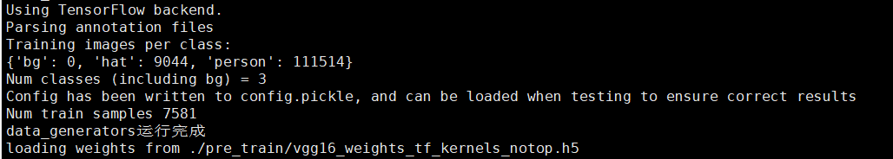
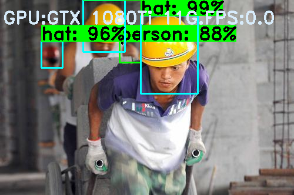
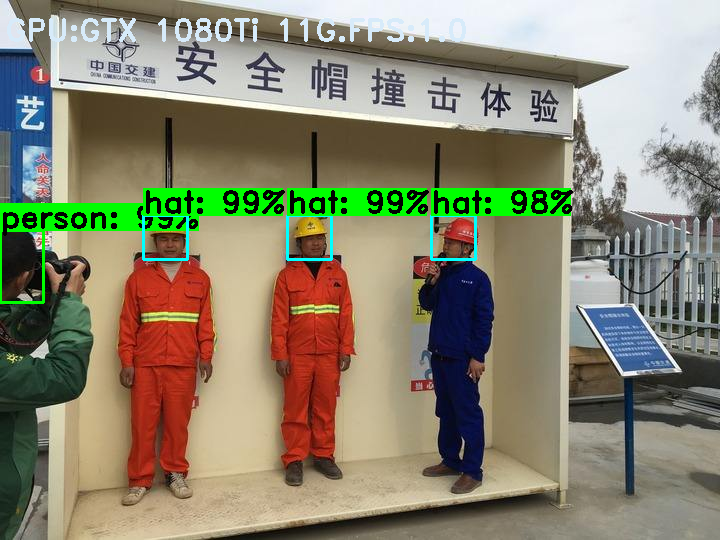
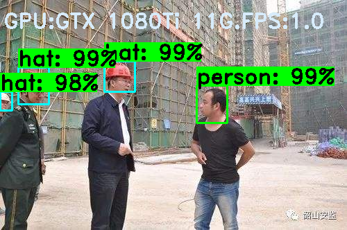

## 基于Faster R-CNN的安全帽目标检测

**Xu Jing**

### 0. :bug: 关于数据

+ 请参考<https://github.com/DataXujing/YOLO-V3-Tensorflow>

### 1. :fire: 训练模型前的准备

+ A.数据准备

数据的标注仍然采用VOC格式的数据标注形式，如果是其他的标注形式比如COCO请自行实现相关代码。将数据最终转化为如下形式：

```
    #  单行数据的结构： (path_filename, x1, y1, x2, y2, class_name)
    # Note:
    #   一个path_filename 可能对应多个类别(class_name)，每个类别占用一行数据
    #   x1, y1, x2, y2 是原图像的坐标, 而不是ratio后图像上的坐标
    #   (x1, y1) 标注框的左上坐标; (x2, y2) 标注框的右下坐标
    #   x1,y1-------------------
    #   |                       |
    #   |                       |
    #   |                       |
    #   |                       |
    #   ---------------------x2,y2
```

可以运行如下代码实现数据集的准备工作:

```
python3 ./data/data_pro.py
```

将在`./data`文件夹下生成`annotation.txt`文件，这样训练数据的准备工作即完成。

```
# path_filename, x1, y1, x2, y2, class_name
/home/myuser/xujing/Faster-R-CNN_hat/data/JPEGImages/000605.jpg,37,12,151,154,hat
/home/myuser/xujing/Faster-R-CNN_hat/data/JPEGImages/000605.jpg,243,1,393,176,hat
/home/myuser/xujing/Faster-R-CNN_hat/data/JPEGImages/PartB_02176.jpg,92,593,180,684,person
/home/myuser/xujing/Faster-R-CNN_hat/data/JPEGImages/PartB_02176.jpg,229,648,357,777,person
```


+ B.配置文件准备

根据自己的训练集和训练任务修改`./keras_frcnn/config.py`的配置文件,相关参数的解释和配置如下：

```
self.verbose = True  # 显示训练过程
self.network = 'vgg' # backbone 目前支持vgg(VGG16),resnet50,xception,inception_resnet_v2

# 数据增强策略
self.use_horizontal_flips = False  # 水平随机裁剪
self.use_vertical_flips = False  # 垂直随机裁剪
self.rot_90 = False    # 随机90度旋转

# Anchor Box的scale
# 根据具体的情况去修改，一般是图像或目标的大小做调整！！！！
# self.anchor_box_scales = [128,256,512]
self.anchor_box_scales = [4,8,16,64,128,256,512,1024]


# Anchor Box的ratio
self.anchor_box_ratios = [[1, 1], [1, 2], [2, 1]]
# self.anchor_box_ratios = [[1, 1]]

# 图像最小变填充后的尺寸
self.im_size = 600

# 图像channel-wise上的mean和std,这个值是根据ImageNet数据集得到的
# 可以根据自己训练集调整
self.img_channel_mean = [103.939, 116.779, 123.68]
self.img_scaling_factor = 1.0

# 一次得到的ROI的个数
self.num_rois = 32

# RPN网络特征图的缩小倍数(VGG16的是16,其他网络请自行修改该参数)
# 换网络时 要换的！！！
self.rpn_stride = 16
# 训练时是否做类别blance
self.balanced_classes = False

# Regression时的scaling the stdev
self.std_scaling = 4.0
self.classifier_regr_std = [8.0, 8.0, 4.0, 4.0]

# 训练集制作过程中的正负样本的划分策略，详细才考faster R-CNN原论文
# overlaps for RPN
self.rpn_min_overlap = 0.3
self.rpn_max_overlap = 0.7

# overlaps for classifier ROIs
self.classifier_min_overlap = 0.1
self.classifier_max_overlap = 0.5

# class类别映射
self.class_mapping = None

# base network的预训练模型的存放位置
# keras预训练模型可以在这里下载： https://github.com/fchollet/deep-learning-models

self.model_path = './pre_train/vgg16_weights_tf_kernels_notop.h5'  # 我们使用VGG16

```


### 2. :racehorse: 训练模型

预训练模型的下载地址： <https://github.com/fchollet/deep-learning-models>

Shell下运行：

```
python3 train_frcnn.py --path="./data/annotation.txt" --network="vgg" --input_weight_path="./pre_train/vgg16_weights_tf_kernels_notop.h5"
```

windows下直接运行我们写好的批处理文件：

```
run_train.bat
```




### 3. :rocket: 模型推断

将需要测试的图像和视频拷贝到`./new_test`文件夹

+ A.单张图像推断

Shell下运行：

```
python3 test_frcnn.py --path="./new_test"
```

windows下直接运行我们写好的批处理文件：
```
run_inference.bat
```

+ B.视频推断

Shell下运行：

```
python3 test_frcnn_video.py --path="./new_test/test_video.mp4"
```

windows下直接运行我们写好的批处理文件：
```
test_video.bat
```

### 4. :tada: DEMO








###  :white_check_mark: Reference

[1] [Faster R-CNN: Towards Real-Time Object Detection with Region Proposal Networks, 2015](https://arxiv.org/pdf/1506.01497.pdf) 

[2] [Inception-v4, Inception-ResNet and the Impact of Residual Connections on Learning, 2016](https://arxiv.org/pdf/1602.07261.pdf) 

[3] [https://github.com/you359/Keras-FasterRCNN](https://github.com/you359/Keras-FasterRCNN)

[4] [Keras Pretrained Model Zoo](https://github.com/fchollet/deep-learning-models)

[5] [Hat Data Introduction](https://github.com/DataXujing/YOLO-V3-Tensorflow)

